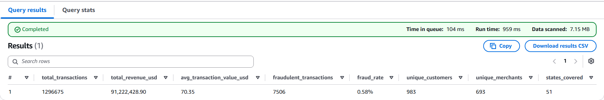
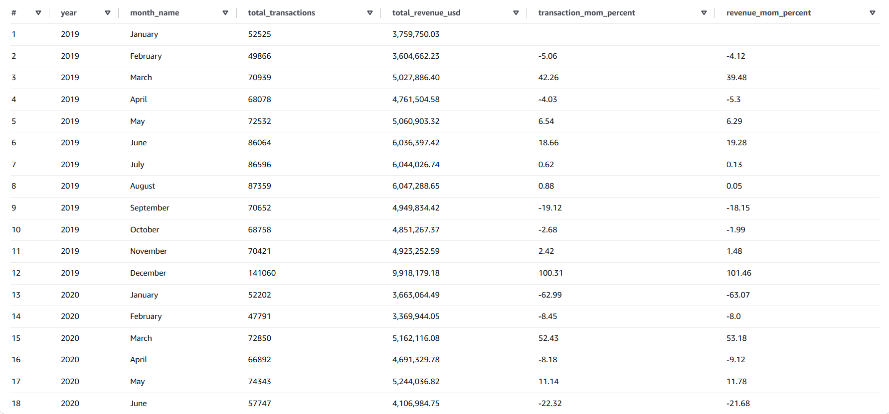
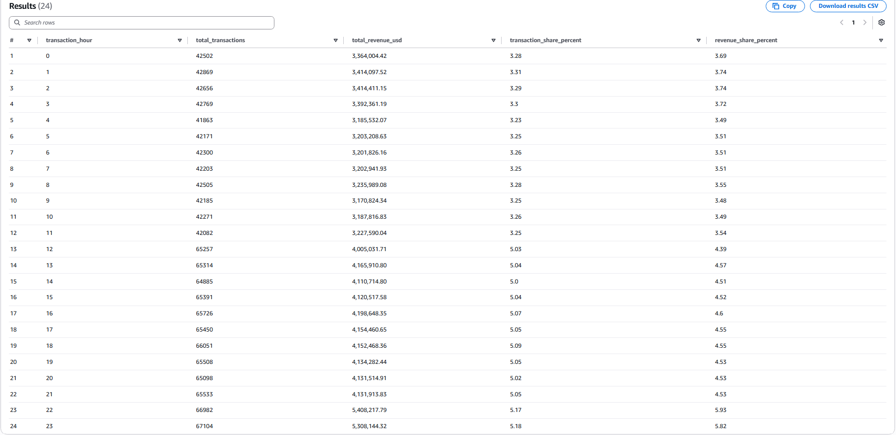

# SQL Analysis

This section demonstrates how Amazon Athena was used to analyze the curated transaction data stored in Amazon S3. The objective of these queries is to answer key business questions, validate the data warehouse, and generate insights that inform the Power BI dashboards.

---

# Question 1: What are the overall business KPIs?

## SQL Query

```sql
SELECT
    COUNT(*) AS total_transactions,

    FORMAT('%,.2f', SUM(transaction_amount)) AS total_revenue_usd,

    FORMAT('%,.2f', AVG(transaction_amount)) AS avg_transaction_value_usd,

    SUM(CASE WHEN fraud_flag = 1 THEN 1 ELSE 0 END) AS fraudulent_transactions,

    CONCAT(
        CAST(
            ROUND(
                100.0 * SUM(CASE WHEN fraud_flag = 1 THEN 1 ELSE 0 END) / COUNT(*),
                2
            ) AS VARCHAR
        ),
        '%'
    ) AS fraud_rate,

    COUNT(DISTINCT credit_card_number) AS unique_customers,

    COUNT(DISTINCT merchant_name) AS unique_merchants,

    COUNT(DISTINCT state) AS states_covered

FROM fact_transactions;
```

## Result



## Insights

- Processed **1.29 million transactions** totaling **$91.22 million** in transaction value across **983 customers** and **693 merchants**.
- The overall **fraud rate is only 0.58%**, indicating fraudulent transactions are relatively rare but remain an important business risk to monitor.
- The dataset spans **51 states/regions**, providing broad geographic coverage for downstream revenue, customer, and fraud analysis.

---


# Question 2: How do transaction volume and revenue change over time?

## SQL Query

```sql
WITH monthly_summary AS (
    SELECT
        d.year,
        d.month,
        d.month_name,
        COUNT(*) AS total_transactions,
        ROUND(SUM(f.transaction_amount), 2) AS total_revenue
    FROM fact_transactions f
    JOIN dim_date d
        ON f.date_key = d.date_key
    GROUP BY
        d.year,
        d.month,
        d.month_name
)

SELECT
    year,
    month_name,
    total_transactions,
    FORMAT('%,.2f', total_revenue) AS total_revenue_usd,

    ROUND(
        (
            total_transactions -
            LAG(total_transactions) OVER (ORDER BY year, month)
        ) * 100.0
        /
        LAG(total_transactions) OVER (ORDER BY year, month),
        2
    ) AS transaction_mom_percent,

    ROUND(
        (
            total_revenue -
            LAG(total_revenue) OVER (ORDER BY year, month)
        ) * 100.0
        /
        LAG(total_revenue) OVER (ORDER BY year, month),
        2
    ) AS revenue_mom_percent

FROM monthly_summary
ORDER BY year, month;

## Result



## Insights

- Transaction volume and revenue generally moved together throughout the analysis period, indicating a strong positive relationship between customer activity and overall revenue.
- **December 2019** recorded the highest monthly performance, with transaction volume increasing by **100.31%** and revenue growing by **101.46%** compared to November, highlighting a significant seasonal surge in customer spending.
- Following the December peak, **January 2020** experienced a notable decline in both transaction volume (**-62.99%**) and revenue (**-63.07%**), before gradually recovering over the following months.

---

# Question 3: Which merchant categories generate the most revenue?

## SQL Query

```
SELECT
    m.merchant_category,

    COUNT(*) AS total_transactions,

    FORMAT('%,.2f', SUM(f.transaction_amount)) AS total_revenue_usd,

    FORMAT('%,.2f', AVG(f.transaction_amount)) AS average_transaction_value,

    ROUND(
        100.0 * SUM(f.transaction_amount)
        / SUM(SUM(f.transaction_amount)) OVER (),
        2
    ) AS revenue_contribution_percent

FROM fact_transactions f
JOIN dim_merchant m
    ON f.merchant_name = m.merchant_name

GROUP BY
    m.merchant_category

ORDER BY
    SUM(f.transaction_amount) DESC;
```

## Result


## Insights

- **Grocery POS** generated the highest revenue at **$14.56 million**, contributing **15.96%** of the platform's total transaction value, making it the largest revenue-driving merchant category.
- The top four merchant categories (**Grocery POS, Shopping POS, Shopping Net, and Gas & Transport**) together contributed **approximately 45.2%** of total revenue, indicating that a relatively small number of categories account for nearly half of all transaction value.
- While **Gas & Transport** processed the highest transaction volume (**131,659 transactions**), **Grocery POS** achieved substantially higher revenue due to its significantly larger **average transaction value ($115.99)**.

---

# Question 4: Which states contribute the highest revenue?

## SQL Query

```sql
SELECT
    l.state,
    COUNT(*) AS total_transactions,
    ROUND(SUM(f.transaction_amount),2) AS total_revenue
FROM fact_transactions f
JOIN dim_location l
ON f.city = l.city
AND f.state = l.state
GROUP BY
    l.state
ORDER BY
    total_revenue DESC;
```

## Result


## Insights

- **Texas (TX)** generated the highest transaction revenue (**$6.80 million**) while also recording the highest transaction volume (**94,876 transactions**), making it the platform's strongest-performing state.
- **New York (NY)** and **Pennsylvania (PA)** ranked second and third respectively, with each contributing more than **$5.7 million** in transaction value.
- The top-performing states consistently show both high transaction volumes and high revenue, suggesting that transaction frequency is a key driver of overall revenue across regions.

---

# Question 5: Which merchant categories contribute the most to fraudulent transactions?

## SQL Query

```sql
SELECT
    m.merchant_category,

    COUNT(*) AS total_transactions,

    SUM(CASE WHEN fraud_flag = 1 THEN 1 ELSE 0 END) AS fraud_transactions,

    ROUND(
        100.0 *
        SUM(CASE WHEN fraud_flag = 1 THEN 1 ELSE 0 END)
        / COUNT(*),
        2
    ) AS fraud_rate_percent,

    ROUND(
        100.0 *
        SUM(CASE WHEN fraud_flag = 1 THEN 1 ELSE 0 END)
        / SUM(SUM(CASE WHEN fraud_flag = 1 THEN 1 ELSE 0 END)) OVER (),
        2
    ) AS fraud_contribution_percent

FROM fact_transactions f
JOIN dim_merchant m
    ON f.merchant_name = m.merchant_name

GROUP BY
    m.merchant_category

ORDER BY
    fraud_rate_percent DESC

LIMIT 5;
```

## Result


## Insights

**Metrics**

Fraud Rate (%) → Measures the likelihood of fraud within a category (risk).
Fraud Contribution (%) → Measures how much each category contributes to total fraud (business impact).

- **Shopping Net** recorded the highest fraud rate (**1.68%**), indicating it is the riskiest merchant category despite not processing the highest transaction volume.
- **Grocery POS** accounted for the largest share of fraudulent transactions (**23.31%**), contributing **1,750 fraud cases**, making it the category with the greatest overall fraud impact.
- The top five merchant categories together represent a significant proportion of all fraudulent transactions, highlighting key areas where fraud monitoring and detection efforts should be prioritized.

---

# Question 6: Who are the highest spending customers?

## SQL Query

```sql
SELECT
    credit_card_number,

    COUNT(*) AS total_transactions,

    FORMAT('%,.2f', SUM(transaction_amount)) AS total_spent_usd

FROM fact_transactions

GROUP BY
    credit_card_number

ORDER BY
    SUM(transaction_amount) DESC

LIMIT 10;
```

## Result


## Insights

- The highest spending customer generated **$296,436.73** across **3,110 transactions**, demonstrating a small segment of customers with exceptionally high purchasing activity.
- The top 10 customers all recorded **more than 3,000 transactions** and spent between **$275K and $296K**, indicating a relatively consistent level of engagement among the platform's highest-value customers.
- Identifying high-value customers enables businesses to develop targeted retention strategies, personalized offers, and loyalty programs to maximize customer lifetime value.

---

# Question 7: During which hours are customers most active?

## SQL Query

```sql
SELECT
    HOUR(transaction_timestamp) AS transaction_hour,

    COUNT(*) AS total_transactions,

    FORMAT('%,.2f', SUM(transaction_amount)) AS total_revenue_usd,

    ROUND(
        100.0 * COUNT(*)
        / SUM(COUNT(*)) OVER (),
        2
    ) AS transaction_share_percent,

    ROUND(
        100.0 * SUM(transaction_amount)
        / SUM(SUM(transaction_amount)) OVER (),
        2
    ) AS revenue_share_percent

FROM fact_transactions

GROUP BY
    HOUR(transaction_timestamp)

ORDER BY
    transaction_hour;
```

## Result



## Insights

- Customer activity remains relatively consistent throughout the day, with each hour contributing approximately **3–5%** of total daily transactions, indicating a well-distributed transaction pattern.
- Transaction activity increases noticeably from **12 PM onwards**, with afternoon and evening hours accounting for the highest transaction volumes and revenue contributions.
- **10 PM (22:00)** and **11 PM (23:00)** recorded the highest revenue contribution (**5.93%** and **5.82%**, respectively), making late evening the busiest revenue-generating period in the dataset.

---